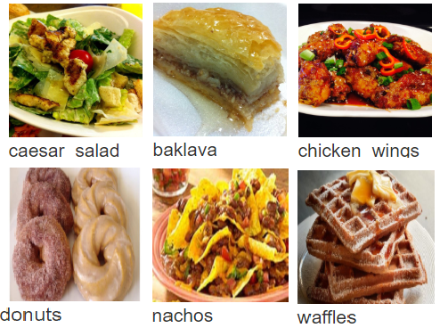

# NeuralCook

Deep learning application to identify ingredients from cooking dishes images and recommend dishes to cook, given a set of ingredients. This application leverages NLP and Computer Vision to learn semantic knowledge using joint embeddings.

Parsing an image of a dish and identifying its ingredients is not a complex task for humans. Indeed, people can quickly identify the dish and its ingredients just by looking at it. But it is much more complex for computers. To produce systems that can achieve this, we combine current state-of-the-art techniques in both Computer Vision and Natural Language Processing to learn the semantic knowledge from both images and recipes using joint embeddings.

# Dataset
The distinction between the difficulty of the chosen problem and previous supervised classification problems is that there are large overlaps in food dishes, as dishes of different categories may look very similar only in terms of image information. To address this complexity, we used the datasets from multiple sources - Food-101, allrecipes.com, and Recipe1M+ are the primary sources.

 

Our dataset consists of over 120,000 images and 5000 ingredient types. Food-101 dataset consists of images of food, organized by the type of food into 101 categories. It was used in the Paper "Food-101 - Mining Discriminative Components with Random Forests" by Lukas Bossard, Matthieu Guillaumin, and Luc Van Gool[2]. For the ingredients, we web scraped allrecipes.com using python scripts and regular expressions.

```
python web_scrapping/recipe_scrapper.py
```

This command scraps the data from allrecipes.com. You need to further download Food-101 data from https://www.kaggle.com/kmader/food41  

# Data Preprocessing
 

The ingredients data obtained from web scrapping consists of unstructured texts. For instance, ingredients are texts like "1 tablespoon of salt", "3/4 cup of rice". Here, tablespoon and cup represent the quantity and not ingredient. 

Also, few ingredient texts consisted of similar same ingredients with different names, like "bbq sauce" and "barbeque sauce", "smith apples" and "granny smith apples".To clean such data and to extract ingredient names from ingredients texts, we used NLP operations, text analysis, pre-processing, and keywords identification. 

To cluster the similar ingredients into one bucket, we used and open source software, OpenRefine, which clusters the words together based on various distance metrics and algorithms.

The images from food-101 and allrecipes.com are preprocessed, cleaned, and resized into 512 x 512.

# Run the model training

We train three deep learning models to learn the joint embeddings for the images and ingredients/recipe. Here we utilize the paired (recipe and image) data to learn a common embedding space.

 

```
python text_preprocessing.py
python intent_extraction.py
python Food_classification.py
python recipe_model.py
```
First, for the image representation we adopt state-of-the-art 16-layer VGGNet pre-trained on ImageNet as a base network and build a customized Convolutional Neural Network classifier on top of it to categorize the input dish image into one of the 101 categories.

We then remove the softmax classification layer from the model and use the output from the last fully connected layer to encode the images into 4096-dimension embeddings.

Secondly, before building the ingredient model, we clean and pre-process the ingredient text. For each ingredient we learn an ingredient level embedding representation. To do so, we train a customized Bidirectional LSTM (Bi-LSTM) to learn the features and the embedding space like that of the first model. The rationale for using a Bi-LSTM is that the ingredients list is an unordered set.

Finally, the ingredients embeddings and image embeddings are used to learn the Joint Embeddings. In simple terms, the goal is to learn transformations to make the embeddings for an image-ingredient pair close. To ensure this closeness, the model is trained with cosine similarity loss.

 
.png) 
